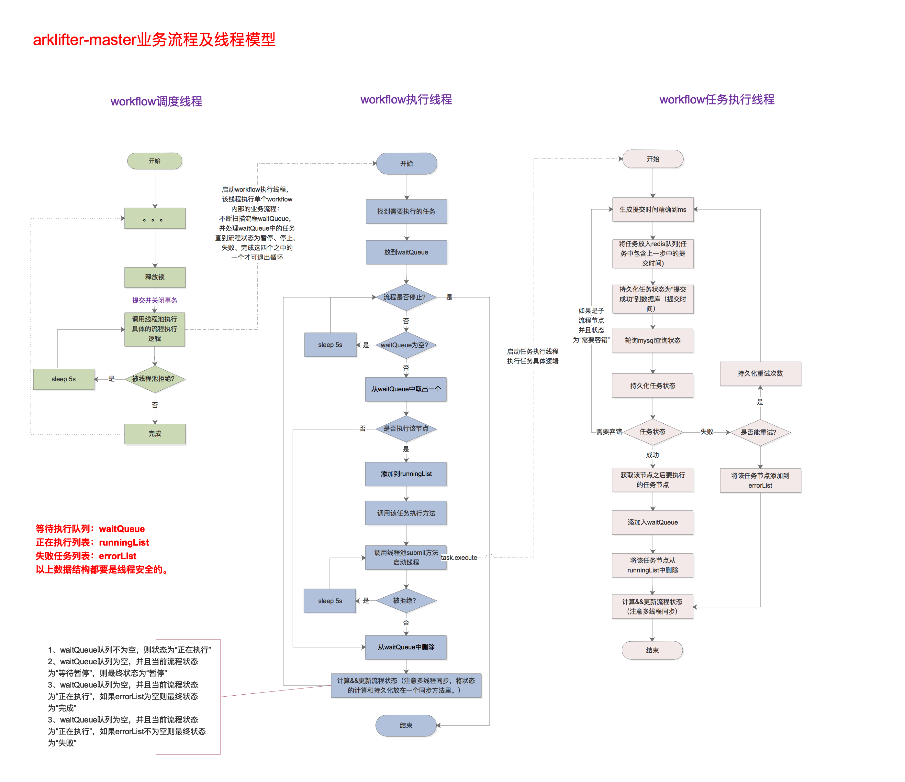
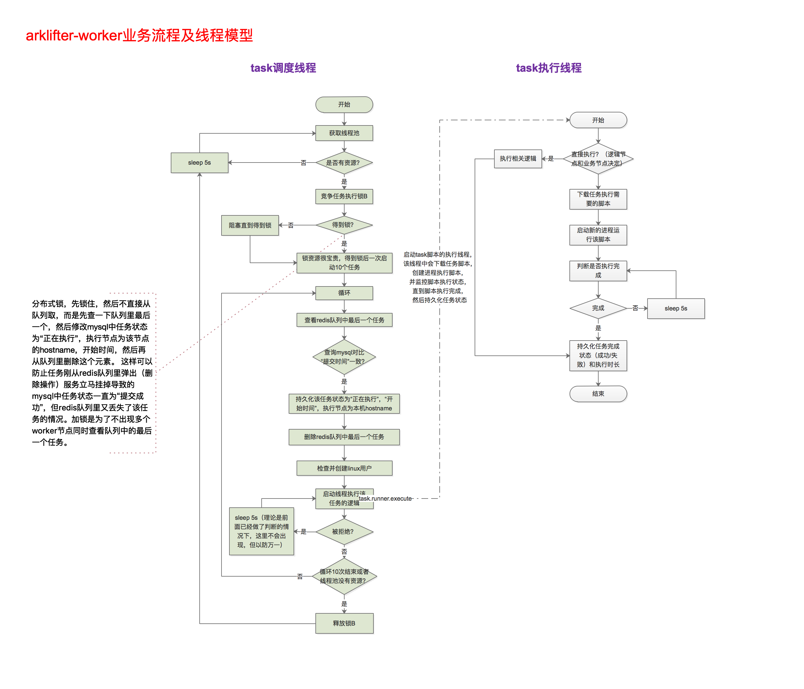

## 4.2 任务调度

系统中的任务调度有两种情况，一种是由工作流调度的任务，还有一种是用户直接在**UI**上编辑脚本，然后点击**运行脚本**提交的**即席查询**任务。

ArkLifter的任务状态有：

1. 提交成功
2. 正在执行
3. 准备暂停（子流程节点）
4. 暂停
5. 准备停止（子流程节点）
6. 停止（子流程节点）
7. 失败
8. 成功
9. 需要容错

### 4.2.1 工作流任务调度

工作流任务调度由**escheduler-masgter**和**escheduler-worker**共同完成。**escheduler-master**负责工作流的调度，以及工作流中各个任务节点的流转。如果任务节点是逻辑节点，则直接在**escheduler-master**节点执行，如果是业务节点，则放到redis队列，并一直轮询mysql中该任务的状态，直到该任务为成功或失败。

下图为escheduler-master节点中相关业务流程图

下图为escheduler-worker节点中相关业务流程图

### 4.2.2 即席查询（下个版本）

即席查询是用户在**UI**编写脚本之后，如果想测试脚本运行效果，可以直接点击**运行**来运行脚本。因为即席查询不是调度系统的核心功能，我们这个版本先不做。只提供一个脚本输入框，提供脚本编辑，查看和保存功能。
