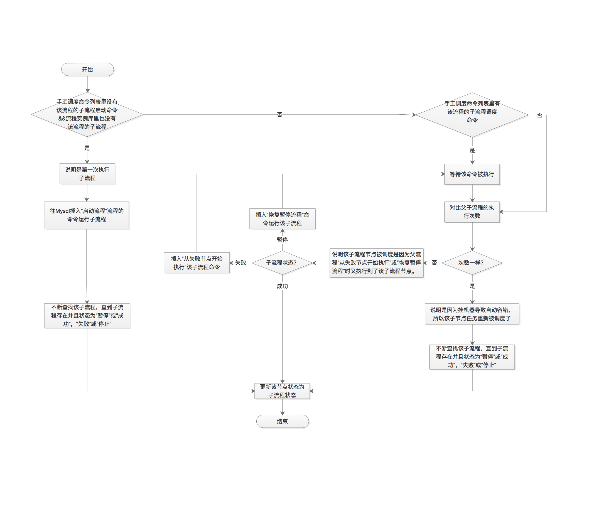

## 4.6 可插拔的任务类型

在ArkLifter中，任务类型是可插拔的，每种任务类型为一个jar包，该jar包里包括了一个metainfo.xml文件用来定义该任务的配置参数，以及该任务类型的执行器class。然后是该任务类型对应的执行器代码，每种任务类型的执行器都要继承至AbstractTaskRunner，该抽像类位于escheduler-task-base项目中。

这种设计也是为了方便用户扩展自己的任务类型。下面介绍具体的系统自带的任务类型。

### 4.6.1 开始节点

### 4.6.2 子流程节点

子流程节点用来调度一个子流程，该节点的状态依赖于其调度的子流程的状态。

下面是子流程节点的执行器业务逻辑

### 4.6.3 汇聚节点

### 4.6.4 shell节点

