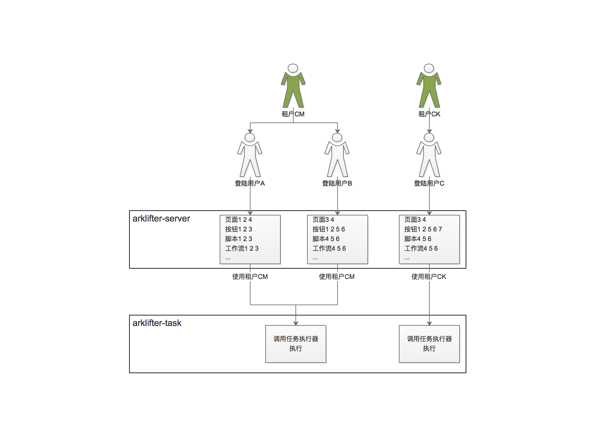

## 4.4 安全架构

EasyScheduler的安全架构主要包括：

* 用户体系
* 权限体系

用户体系对应如下：

### 4.4.1 用户体系

EasyScheduler主要面对数据平台的任务调度，数据平台自身有一套安全体系来管理不同的用户、资源、作业等，正常情况下大数据平台的用户个数有限，不可能为业务部门的每一个人开通一个单独的用户，所以往往需要业务部门的多个人使用同一个大数据平台用户来完成作业的开发、测试、部署、执行等工作。基于上述业务场景，我们将EasyScheduler的用户体系用为**超级管理员-租户-用户**。下面详细说明：

1. 超级管理员

    EasyScheduler中所有对于用户体系的操作都必须由超级管理员来完成。当有新用户加入时，超级管理员负责根据情况选择**新增租户**然后在新增的租户下**新增用户**，或者直接在已存在的**租户**下**新增用户**。
    
2. 租户
    
    租户在系统中为非实际用户，无法登陆，只在**Task Runner**执行任务时才会使用。每个任务都有两个用户属性，**所属用户**和**执行用户**，**所属用户**即是系统的登陆用户，而**执行用户**是任务真正执行时使用的用户在系统中就是用户的**租户**。比如系统的用户user1,user2都属于租户hadoop1，那么user1,user2登陆系统之后在页面上只能看到各自自己的内容，但是所有对大数据平台的操作都是使用租户hadoop1去完成的，比如user1,user2访问hive的一张表tab1，那么hive接收到的请求永远是hadoop1用户发起的，和user1,user2无关。
    
    **注意：**所有对后台（包括：后台linux，大数据平台hadoop,hive,hbase,spark,mr,presto）的操作接口设计都要包含**用户**和**租户**两个参数，**用户**用来标识是谁提交的请求，**租户**标识由谁去执行平台操作。
        
3. 用户
    
    用户只能修改自己的密码，无法进行用户、租户的管理。不同的用户通过权限体系的控制，在系统中会看到不同的内容。
    
### 4.4.2 权限体系

EasyScheduler的权限体系只包含功能权限，主要有：

1. 页面元素到按钮级别，不同的用户可能看到的按钮都不尽相同。
2. 页面显示内容，不同的用户只能看到自己有权限的显示内容，比如同样的**工作流列表**页面，不同的用户只能看到自己有权限看的工作流，一般为用户自己设计的工作流。

EasyScheduler的权限体系不包含数据权限功能：这里的**数据权限**是指大数据平台HDFS,HIVE,HBASE,SPARK,PRESTO等数据的访问权限。EasyScheduler不对数据平台的数据访问权限做管理，这应该交由数据平台部门去维护和管理。
