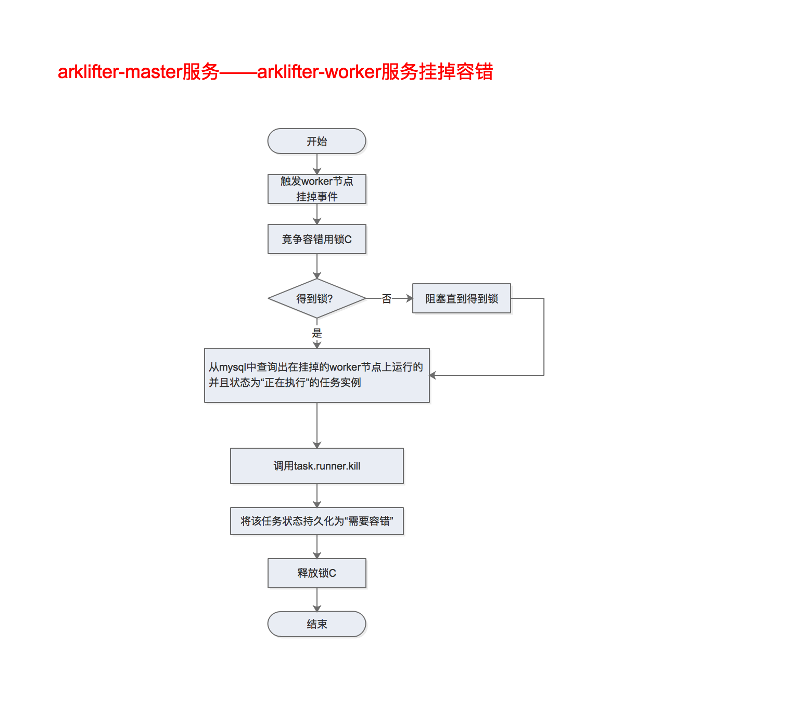
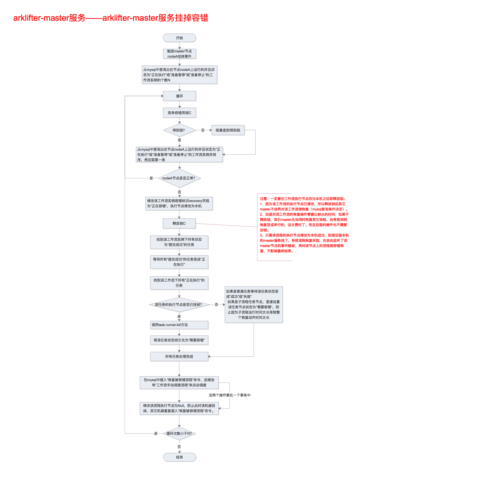
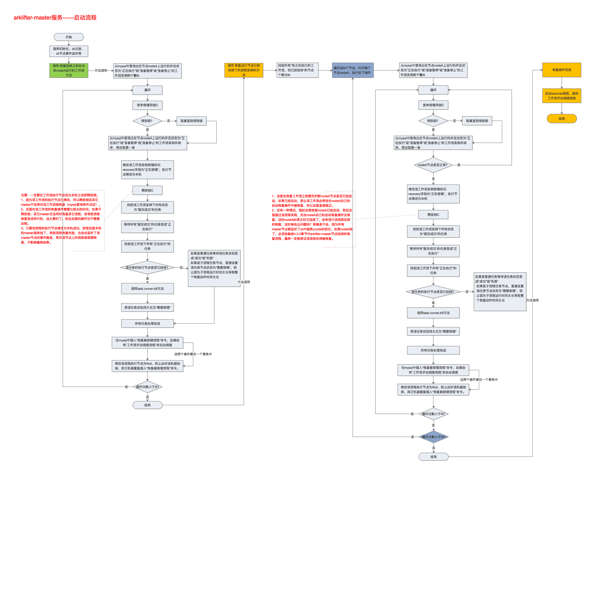

## 4.3 容错

### 4.3.1 任务失败重试

#### 4.3.1.1 说明

我们将工作流中的任务节点分了两种类型。

一种是业务节点，这种节点都对应一个实际的脚本或者处理语句，比如shell节点，hive节点，preso节点，mr节点，spark节点等。

还有一种是逻辑节点，这种节点不做实际的脚本或语句处理，只是整个流程流转的逻辑处理，比如汇聚节点，开始节点，结束节点，子流程节点，延时节点，条件检测节点。

每一个**业务节点**都可以配置失败重试的次数，当该任务节点失败，会自动重试，直到成功或者超过配置的重试次数。

**逻辑节点**不支持失败重试。

**工作流整体不可失败重试**，如果工作流中有任务失败达到最大重试次数，工作流就会失败停止，失败的工作流不支持重试操作，只能**从失败的节点开始执行**或**从当前节点开始执行**，这是一种流程恢复的操作，不是重试。

#### 4.3.1.2 实现方式    

整个系统的任务调度方式是由**escheduler-master**服务中的**workflow-scheduler**将任务放入**Task Queue**中，然后由**escheduler-worker**服务中的**task-scheduler**从**Task Queue**中领取并执行，如果任务执行失败，由**task-scheduler**将任务状态更新到mysql中，**workflow-scheduler**中轮询mysql获取task状态，当获取到task状态为失败后，判断该节点如果可以重试，就将该task再次放到到**Task Queue**中，直到该task成功完成或达到最大重试次数。

### 4.3.2 escheduler-worker节点挂掉

escheduler系统中，**escheduler-worker**节点负责从redis队列中取任务并执行，**escheduler-master**负责工作流的调度，工作流中任务的调度，还有系统中**escheduler-worker**和**escheduler-master**服务挂掉后的容错处理。下面详细说明下容错相关的技术细节。

**escheduler-worker**节点在启动时会在zk的/escheduler/worker目录下创建临时节点，**escheduler-master**服务中会对/escheduler/worker/目录做监听，当有**escheduler-worker**服务挂掉，**escheduler-master**服务中的监听会被触发，此做如下处理：

因为在**escheduler-master**节点中每一个任务对应一个轮询任务状态的线程，所以经过以上步操作后，该线程会看到其所监控的任务状态变成**失败**，然后该线程会根据重试的配置来重试该任务。具体的重试机制可以参考[任务失败重试](#retry)和[escheduler-master节点线程模型中任务执行线程](#retry_process)。

### 4.3.3 escheduler-master节点挂掉

**escheduler-master**节点挂掉后，其它master节点需要将跑在挂掉的master节点上的工作流实例重新恢复，通过多个master竞争锁的方式，可以将挂掉的master节点上的多个工作流实例均衡的分布在活着的master节点上。

业务流程图如下：

### 4.3.4 全部escheduler-master节点挂掉

考虑一种情况，所有master节点同时挂掉，导致所有master节点都没有收到zk中节点删除事件。应对这种可能的情况，我们在每个master节点启动时就要做一系列的恢复检查和恢复操作，并且在检查和恢复操作完成之前，新启动的master节点不进行新的手工工作流的调度（quartz的调度正常提供），直到所有恢复操作完成，然后才启动**scanner**线程，提供基于命令的流程调度服务。基本的思路如下：

1. 将所有状态为“正在运行”并且运行节点为本机的流程实例进行**恢复**操作。
2. 将所有状态为“正在运行”并且运行节点挂掉的流程实例进行**恢复**操作。
3. 开启**scanner**线程，开始提供基于命令的流程调度服务。

具体的业务流程如下：

